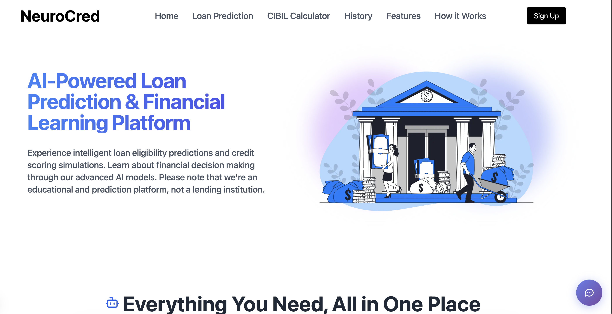
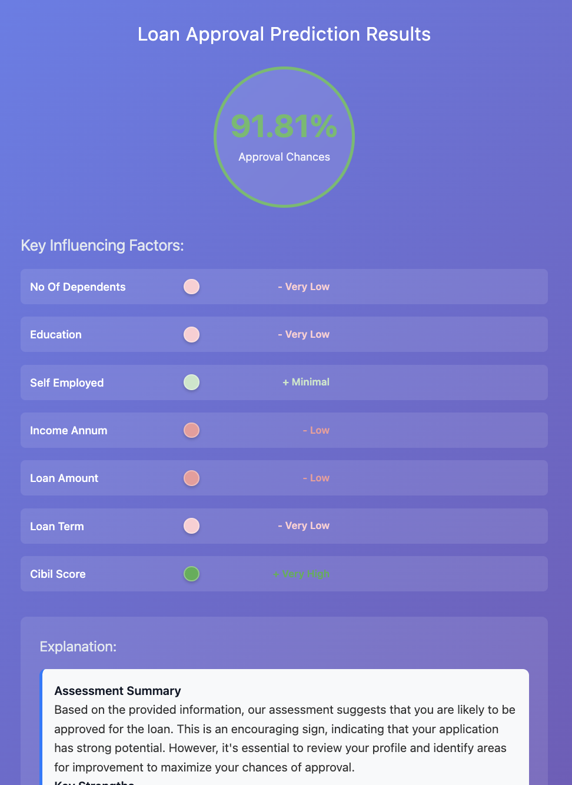
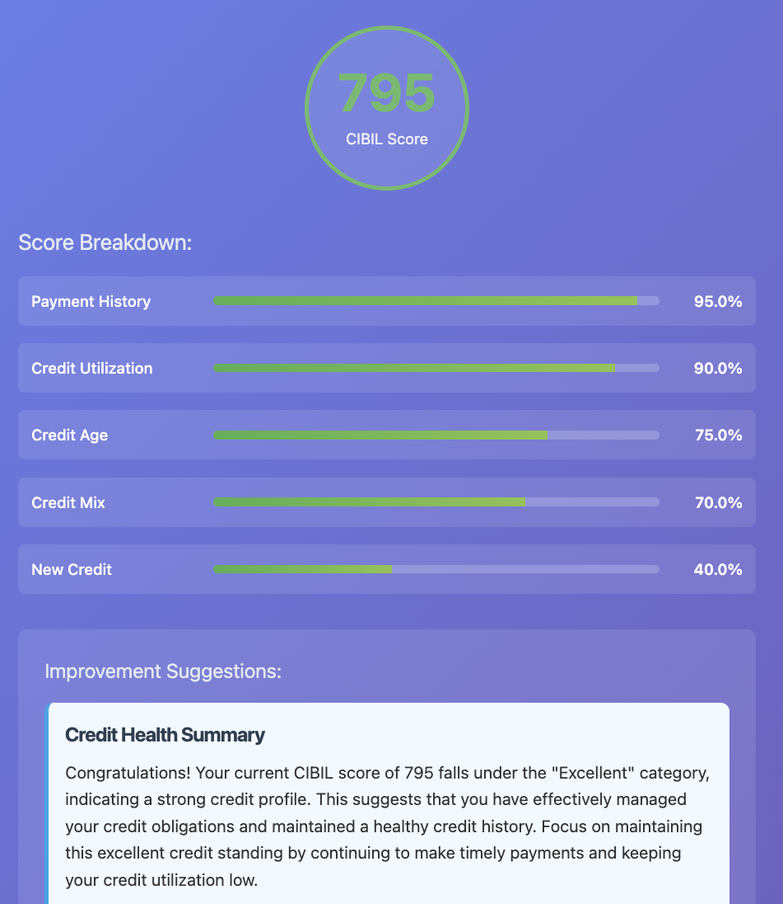
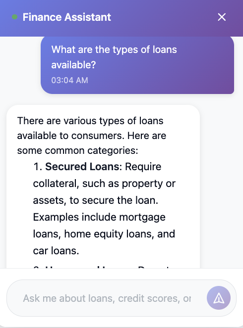
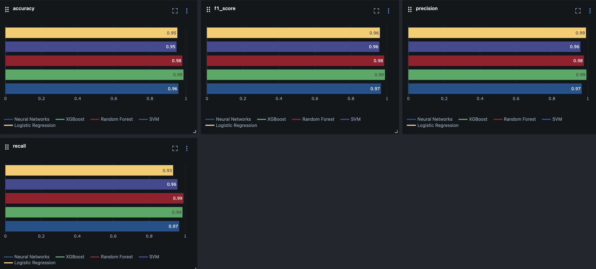

#  NeuroCred

**NeuroCred** is a comprehensive, full-stack fintech platform designed to empower users with AI-driven financial insights and decision-making tools. The platform leverages advanced machine learning models to provide loan approval predictions with explainability, estimates CIBIL scores with personalized improvement guidance, and offers interactive financial counseling via a RAG-powered AI chatbot.

  

---

## Features

### Loan Approval Prediction & Explainability
- **98% Accurate Loan Approval Prediction:** Predicts loan approval from applicant financial profiles.
- **Decision Explainability:** Highlights the factors influencing each prediction.
- **Natural Language Explanations:** Explains predictions in clear, easy-to-understand language.

  

---

### CIBIL Score Analytics
- **CIBIL Score Estimation:** Estimates CIBIL scores using key credit factors.
- **Credit Health Summary:** Provides an overview of the calculated score.
- **AI Recommendations:** Generates personalized suggestions to improve credit health.

  

---

### Financial Assistant
- **Financial Q&A:** Answers questions on loans, credit scores, and personal finance.
- **Retrieval-Augmented Responses:** Uses relevant financial knowledge to answer queries.

  

---

### MLOps
- **Experiment Tracking:** Logs model experiments, metrics, and artifacts.
- **Data Versioning:** Tracks dataset versions for reproducible workflows.

  

---

### Authentication & History
- **Secure Authentication:** User signup, login, and JWT-based session management.
- **Password Recovery:** Reset passwords securely via email.
- **History Tracking:** Stores previous loan predictions and CIBIL checks.

---

## Tech Stack

| Category | Technologies |
|----------|--------------|
| **Frontend** | Next and Tailwind CSS |
| **Backend** | FastAPI |
| **Database** | MongoDB and ChromaDB |
| **AI / ML** | Scikit-learn, SHAP and LangChain |
| **MLOps** | MLflow and DVC |
| **Authentication** | JWT |

## Developers

- [Armaan Jagirdar](https://github.com/Armaan457)
- [Khusham Bansal](https://github.com/KhushamBansal)